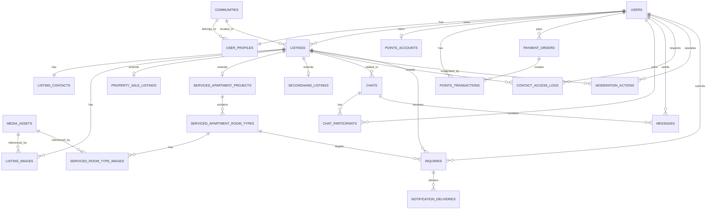

# 统一频道系统数据模型与 ERD

## 1. 文档信息

| 项目 | 内容 |
| --- | --- |
| 文档名称 | 统一频道系统数据模型与 ERD |
| 适用范围 | 统一入口页 + 楼盘放售频道 + 服务式住宅频道 + 二手邻里交易频道 |
| 当前版本 | `v0.1` |
| 文档状态 | Draft |
| 上游输入文档 | 三份需求文档、三份 MVP 功能清单、`统一页面与三大子模块-功能总整理（简体）.md`、`统一频道系统-页面清单与页面流转图（简体）.md` |
| 文档目的 | 定义统一频道系统的核心数据模型、实体边界、关系结构、状态枚举和关键索引，作为后续数据库设计、接口设计、测试设计和研发拆解的基线 |

## 2. 设计结论

### 2.1 推荐技术基线
- 推荐数据库：`PostgreSQL 15+`
- 字符集：`UTF-8`
- 时间字段：统一使用 `timestamptz`
- JSON 字段：优先使用 `jsonb`
- 内部主键：`BIGINT`
- 外部资源标识：统一使用 `public_id`，推荐 `ULID(26)` 或同级别可排序字符串 ID

### 2.2 建模原则
- 使用一张统一主表 `listings` 承载三大子模块的共通字段。
- 各子模块通过扩展表承载差异字段，避免一张超宽表失控。
- 联系方式、消息、图片、生命周期、审核、审计能力做成公共服务层。
- 敏感信息单独建表并加密存储，禁止在公开接口中直接透出。
- 所有业务删除默认采用软删除，不做物理删除。

### 2.3 当前系统级数据策略
- `listings` 负责承载统一发布体。
- `property_sale_listings`、`serviced_apartment_projects`、`secondhand_listings` 负责承载模块扩展字段。
- 服务式住宅采用“项目主表 + 房型子表”的父子模型。
- 积分、支付、询盘、消息采用公共域服务表，不与单一模块强绑定。

## 3. 主数据与状态模型

### 3.1 统一状态设计

| 状态域 | 字段 | 推荐枚举值 | 说明 |
| --- | --- | --- | --- |
| 发布状态 | `publication_status` | `draft`、`active`、`expired`、`hidden`、`deleted` | 统一帖子生命周期状态 |
| 审核状态 | `moderation_status` | `pending_review`、`approved`、`rejected` | 内容审核状态 |
| 业务状态 | `business_status` | `available`、`sold`、`inactive` | 模块业务结果状态；楼盘放售和二手可用 `sold`，服务式住宅可用 `inactive` |
| 支付状态 | `payment_status` | `pending`、`paid`、`failed`、`closed`、`refunded` | 充值支付状态 |
| 积分流水类型 | `transaction_type` | `topup`、`publish_property`、`renew_property`、`manual_adjust` | AJO Point 账务类型 |
| 联系方式范围 | `contact_mode` | `phone`、`whatsapp`、`chat`、`both`、`mixed` | 前端展示和后端权限判断依据 |
| 邻里可见范围 | `visibility_scope` | `public`、`building_only` | 仅二手邻里交易使用 |
| 询盘状态 | `inquiry_status` | `submitted`、`delivered`、`delivery_failed`、`closed` | 服务式住宅询盘状态 |
| 消息状态 | `message_status` | `sent`、`delivered`、`read` | 站内消息状态 |

### 3.2 生命周期规则统一口径

| 模块 | 默认有效期 | 到期动作 | 恢复动作 |
| --- | --- | --- | --- |
| 楼盘放售 | `30 天` | `publication_status=expired` | 消耗 `1000 AJO Point` 后续期，重置 `expire_at` |
| 服务式住宅 | `28 天` | `publication_status=expired` | 重新发布后重置 `expire_at` |
| 二手邻里交易 | `14 天` | `publication_status=expired` | 重发后重置 `expire_at` |

## 4. ERD 总览

## 5. 公共核心实体

### 5.1 `users`

| 字段 | 类型 | 约束 | 说明 |
| --- | --- | --- | --- |
| `id` | `bigint` | PK | 内部主键 |
| `public_id` | `varchar(26)` | UK | 外部公开 ID |
| `phone_country_code` | `varchar(8)` | NN | 区号，默认支持香港 |
| `phone_number` | `varchar(32)` | UK, NN | 手机号 |
| `member_status` | `varchar(32)` | NN | `active / suspended / disabled` |
| `is_verified_phone` | `boolean` | NN | 是否完成手机号校验 |
| `created_at` | `timestamptz` | NN | 创建时间 |
| `updated_at` | `timestamptz` | NN | 更新时间 |

说明：
- `users` 只承载账号主信息，不把复杂业务字段全部堆入用户表。
- 若后续接入统一会员中心，`users` 可以作为业务侧本地镜像表。

### 5.2 `user_profiles`

| 字段 | 类型 | 约束 | 说明 |
| --- | --- | --- | --- |
| `user_id` | `bigint` | PK, FK | 对应 `users.id` |
| `display_name` | `varchar(120)` |  | 用户昵称 |
| `publisher_identity_type` | `varchar(32)` |  | `owner / agent / professional_seller / operator` |
| `primary_community_id` | `bigint` | FK | 默认所属大厦或屋苑 |
| `district_code` | `varchar(32)` |  | 所属地区 |
| `avatar_asset_id` | `bigint` | FK | 头像媒体资源 |
| `created_at` | `timestamptz` | NN | 创建时间 |
| `updated_at` | `timestamptz` | NN | 更新时间 |

说明：
- 二手邻里交易的邻里权限判断，基于 `primary_community_id`。
- 服务式住宅和楼盘放售的发布者身份展示，也从该表取默认值。

### 5.3 `communities`

| 字段 | 类型 | 约束 | 说明 |
| --- | --- | --- | --- |
| `id` | `bigint` | PK | 内部主键 |
| `public_id` | `varchar(26)` | UK | 外部公开 ID |
| `community_type` | `varchar(32)` | NN | `estate / building` |
| `name_zh` | `varchar(200)` | NN | 中文名 |
| `name_en` | `varchar(200)` |  | 英文名 |
| `district_code` | `varchar(32)` | NN | 地区编码 |
| `parent_community_id` | `bigint` | FK | 所属屋苑或上级楼栋 |
| `address_text` | `varchar(500)` |  | 地址文本 |
| `created_at` | `timestamptz` | NN | 创建时间 |

说明：
- 该表用于统一承载屋苑、大厦等地理社区对象。
- 二手邻里交易的 `building_only` 权限基于该表判断。

### 5.4 `listings`

| 字段 | 类型 | 约束 | 说明 |
| --- | --- | --- | --- |
| `id` | `bigint` | PK | 内部主键 |
| `public_id` | `varchar(26)` | UK | 外部公开 ID |
| `module` | `varchar(32)` | NN | `property_sale / serviced_apartment / secondhand` |
| `owner_user_id` | `bigint` | FK, NN | 发布者 |
| `title` | `varchar(300)` | NN | 标题 |
| `summary` | `varchar(500)` |  | 摘要 |
| `description` | `text` |  | 详情描述 |
| `district_code` | `varchar(32)` | NN | 地区编码 |
| `community_id` | `bigint` | FK | 所属大厦或屋苑，非所有模块必填 |
| `publisher_identity_type` | `varchar(32)` | NN | 发布时快照值 |
| `publication_status` | `varchar(32)` | NN | 生命周期状态 |
| `moderation_status` | `varchar(32)` | NN | 审核状态 |
| `business_status` | `varchar(32)` | NN | 业务状态 |
| `published_at` | `timestamptz` |  | 首次发布成功时间 |
| `sort_refreshed_at` | `timestamptz` |  | 用于重发、续期后排序前移 |
| `expire_at` | `timestamptz` |  | 到期时间 |
| `is_deleted` | `boolean` | NN | 软删除标记 |
| `deleted_at` | `timestamptz` |  | 删除时间 |
| `created_at` | `timestamptz` | NN | 创建时间 |
| `updated_at` | `timestamptz` | NN | 更新时间 |

说明：
- 所有前台列表与详情，默认只暴露 `publication_status=active` 且 `moderation_status=approved` 的记录。
- `sort_refreshed_at` 用于统一支持置顶、续期、重发后排序靠前。

### 5.5 `listing_contacts`

| 字段 | 类型 | 约束 | 说明 |
| --- | --- | --- | --- |
| `listing_id` | `bigint` | PK, FK | 对应 `listings.id` |
| `phone_encrypted` | `text` |  | 加密电话 |
| `phone_masked` | `varchar(64)` |  | 脱敏电话 |
| `whatsapp_encrypted` | `text` |  | 加密 WhatsApp |
| `whatsapp_masked` | `varchar(64)` |  | 脱敏 WhatsApp |
| `email_encrypted` | `text` |  | 加密邮箱，仅服务式住宅主要使用 |
| `show_phone` | `boolean` | NN | 是否展示电话入口 |
| `show_whatsapp` | `boolean` | NN | 是否展示 WhatsApp 入口 |
| `show_chat` | `boolean` | NN | 是否开启站内消息 |
| `show_inquiry_form` | `boolean` | NN | 是否开启询盘表单 |
| `contact_mode` | `varchar(32)` | NN | 联系方式组合模式 |
| `created_at` | `timestamptz` | NN | 创建时间 |
| `updated_at` | `timestamptz` | NN | 更新时间 |

说明：
- 所有敏感联系方式必须加密存储。
- 前台详情页只返回可用渠道摘要，不直接返回明文联系方式。

### 5.6 `media_assets`

| 字段 | 类型 | 约束 | 说明 |
| --- | --- | --- | --- |
| `id` | `bigint` | PK | 内部主键 |
| `public_id` | `varchar(26)` | UK | 外部公开 ID |
| `storage_provider` | `varchar(32)` | NN | `s3 / oss / local` |
| `bucket_name` | `varchar(120)` | NN | 存储桶 |
| `object_key` | `varchar(500)` | NN | 对象路径 |
| `mime_type` | `varchar(100)` | NN | 文件类型 |
| `width` | `integer` |  | 图片宽度 |
| `height` | `integer` |  | 图片高度 |
| `file_size` | `bigint` |  | 文件大小 |
| `checksum_sha256` | `varchar(128)` |  | 摘要 |
| `created_by` | `bigint` | FK | 上传人 |
| `created_at` | `timestamptz` | NN | 创建时间 |

### 5.7 `listing_images`

| 字段 | 类型 | 约束 | 说明 |
| --- | --- | --- | --- |
| `id` | `bigint` | PK | 主键 |
| `listing_id` | `bigint` | FK, NN | 所属帖子 |
| `media_asset_id` | `bigint` | FK, NN | 对应媒体资源 |
| `sort_order` | `integer` | NN | 排序 |
| `is_cover` | `boolean` | NN | 是否封面图 |
| `created_at` | `timestamptz` | NN | 创建时间 |

### 5.8 `contact_access_logs`

| 字段 | 类型 | 约束 | 说明 |
| --- | --- | --- | --- |
| `id` | `bigint` | PK | 主键 |
| `listing_id` | `bigint` | FK, NN | 对应帖子 |
| `request_user_id` | `bigint` | FK, NN | 请求方用户 |
| `granted_channels` | `jsonb` | NN | 本次放行的联系方式渠道 |
| `request_ip` | `varchar(64)` |  | 请求 IP |
| `user_agent` | `varchar(500)` |  | UA |
| `created_at` | `timestamptz` | NN | 请求时间 |

说明：
- 用于防爬审计、频率限制、异常排查。

### 5.9 `chats`

| 字段 | 类型 | 约束 | 说明 |
| --- | --- | --- | --- |
| `id` | `bigint` | PK | 主键 |
| `public_id` | `varchar(26)` | UK | 外部公开 ID |
| `biz_module` | `varchar(32)` | NN | 业务模块 |
| `listing_id` | `bigint` | FK, NN | 关联帖子 |
| `chat_type` | `varchar(32)` | NN | `direct_listing_chat` |
| `created_by` | `bigint` | FK, NN | 发起方 |
| `last_message_preview` | `varchar(500)` |  | 最近消息摘要 |
| `last_message_at` | `timestamptz` |  | 最近消息时间 |
| `created_at` | `timestamptz` | NN | 创建时间 |
| `updated_at` | `timestamptz` | NN | 更新时间 |

### 5.10 `chat_participants`

| 字段 | 类型 | 约束 | 说明 |
| --- | --- | --- | --- |
| `id` | `bigint` | PK | 主键 |
| `chat_id` | `bigint` | FK, NN | 对应会话 |
| `user_id` | `bigint` | FK, NN | 参与用户 |
| `role_in_chat` | `varchar(32)` | NN | `owner / buyer / tenant / inquirer` |
| `last_read_message_id` | `bigint` | FK | 最后已读消息 |
| `unread_count` | `integer` | NN | 未读数缓存 |
| `joined_at` | `timestamptz` | NN | 加入时间 |

### 5.11 `messages`

| 字段 | 类型 | 约束 | 说明 |
| --- | --- | --- | --- |
| `id` | `bigint` | PK | 主键 |
| `public_id` | `varchar(26)` | UK | 外部公开 ID |
| `chat_id` | `bigint` | FK, NN | 所属会话 |
| `sender_user_id` | `bigint` | FK, NN | 发送者 |
| `message_type` | `varchar(32)` | NN | `text / system / inquiry_backup` |
| `content_text` | `text` | NN | 消息文本 |
| `message_status` | `varchar(32)` | NN | 消息状态 |
| `created_at` | `timestamptz` | NN | 创建时间 |

### 5.12 `moderation_actions`

| 字段 | 类型 | 约束 | 说明 |
| --- | --- | --- | --- |
| `id` | `bigint` | PK | 主键 |
| `target_type` | `varchar(32)` | NN | `listing / inquiry / message` |
| `target_id` | `bigint` | NN | 目标主键 |
| `action_type` | `varchar(32)` | NN | `approve / reject / hide / restore / mark_risk` |
| `reason_code` | `varchar(64)` |  | 原因编码 |
| `reason_text` | `varchar(500)` |  | 原因说明 |
| `operator_user_id` | `bigint` | FK, NN | 运营人员 |
| `created_at` | `timestamptz` | NN | 操作时间 |

## 6. 模块扩展实体

### 6.1 楼盘放售模块

#### 6.1.1 `property_sale_listings`

| 字段 | 类型 | 约束 | 说明 |
| --- | --- | --- | --- |
| `listing_id` | `bigint` | PK, FK | 对应 `listings.id` |
| `property_type` | `varchar(64)` | NN | 物业类型 |
| `estate_name` | `varchar(200)` | NN | 屋苑名称 |
| `address_text` | `varchar(500)` |  | 地址文本 |
| `asking_price_hkd` | `numeric(14,2)` | NN | 售价 |
| `saleable_area_sqft` | `integer` | NN | 实用面积 |
| `gross_area_sqft` | `integer` |  | 建筑面积 |
| `bedroom_count` | `integer` |  | 房数 |
| `livingroom_count` | `integer` |  | 厅数 |
| `bathroom_count` | `integer` |  | 厕数 |
| `balcony_count` | `integer` |  | 露台数量 |
| `floor_text` | `varchar(100)` |  | 楼层 |
| `block_no` | `varchar(100)` |  | 座数 |
| `unit_no` | `varchar(100)` |  | 单位编号 |
| `building_age_years` | `integer` |  | 楼龄 |
| `facing_text` | `varchar(100)` |  | 朝向 |
| `view_text` | `varchar(100)` |  | 景观 |
| `decoration_status` | `varchar(100)` |  | 装修状况 |
| `feature_tags` | `jsonb` |  | 特色标签数组 |

#### 6.1.2 `points_accounts`

| 字段 | 类型 | 约束 | 说明 |
| --- | --- | --- | --- |
| `user_id` | `bigint` | PK, FK | 对应 `users.id` |
| `currency_code` | `varchar(16)` | NN | 固定 `AJO` |
| `balance` | `integer` | NN | 当前积分余额 |
| `updated_at` | `timestamptz` | NN | 更新时间 |

#### 6.1.3 `payment_orders`

| 字段 | 类型 | 约束 | 说明 |
| --- | --- | --- | --- |
| `id` | `bigint` | PK | 主键 |
| `public_id` | `varchar(26)` | UK | 外部公开 ID |
| `order_no` | `varchar(64)` | UK | 订单号 |
| `payer_user_id` | `bigint` | FK, NN | 支付用户 |
| `biz_type` | `varchar(32)` | NN | `point_topup` |
| `payment_provider` | `varchar(32)` | NN | `stripe / payme / manual` |
| `payment_status` | `varchar(32)` | NN | 支付状态 |
| `hkd_amount` | `numeric(12,2)` | NN | 港币金额 |
| `points_to_credit` | `integer` | NN | 应增加积分数 |
| `provider_transaction_no` | `varchar(128)` |  | 三方流水号 |
| `paid_at` | `timestamptz` |  | 支付成功时间 |
| `created_at` | `timestamptz` | NN | 创建时间 |
| `updated_at` | `timestamptz` | NN | 更新时间 |

#### 6.1.4 `points_transactions`

| 字段 | 类型 | 约束 | 说明 |
| --- | --- | --- | --- |
| `id` | `bigint` | PK | 主键 |
| `public_id` | `varchar(26)` | UK | 外部公开 ID |
| `user_id` | `bigint` | FK, NN | 用户 |
| `transaction_type` | `varchar(32)` | NN | 积分流水类型 |
| `amount` | `integer` | NN | 正数充值，负数消耗 |
| `balance_after` | `integer` | NN | 变更后余额 |
| `related_listing_id` | `bigint` | FK | 关联帖子 |
| `related_order_id` | `bigint` | FK | 关联支付订单 |
| `remark` | `varchar(500)` |  | 备注 |
| `created_at` | `timestamptz` | NN | 创建时间 |

### 6.2 服务式住宅模块

#### 6.2.1 `serviced_apartment_projects`

| 字段 | 类型 | 约束 | 说明 |
| --- | --- | --- | --- |
| `listing_id` | `bigint` | PK, FK | 对应 `listings.id` |
| `project_name` | `varchar(200)` | NN | 项目名称 |
| `address_text` | `varchar(500)` | NN | 详细地址 |
| `district_code` | `varchar(32)` | NN | 地区编码 |
| `facility_tags` | `jsonb` |  | 公共设施 |
| `service_tags` | `jsonb` |  | 服务清单 |
| `min_monthly_rent_hkd` | `numeric(12,2)` |  | 最低月租，可由房型聚合生成 |
| `room_type_count` | `integer` | NN | 房型数量缓存 |
| `min_lease_months` | `integer` |  | 最短租期聚合缓存 |

#### 6.2.2 `serviced_apartment_room_types`

| 字段 | 类型 | 约束 | 说明 |
| --- | --- | --- | --- |
| `id` | `bigint` | PK | 主键 |
| `public_id` | `varchar(26)` | UK | 外部公开 ID |
| `project_listing_id` | `bigint` | FK, NN | 所属项目 |
| `room_type_name` | `varchar(200)` | NN | 房型名称 |
| `saleable_area_sqft` | `integer` |  | 实用面积 |
| `monthly_rent_hkd` | `numeric(12,2)` | NN | 月租 |
| `utilities_included` | `boolean` | NN | 是否包水电管理费 |
| `min_lease_months` | `integer` |  | 最短租期 |
| `room_facility_tags` | `jsonb` |  | 房内设施 |
| `publication_status` | `varchar(32)` | NN | 房型自身状态 |
| `created_at` | `timestamptz` | NN | 创建时间 |
| `updated_at` | `timestamptz` | NN | 更新时间 |

#### 6.2.3 `serviced_room_type_images`

| 字段 | 类型 | 约束 | 说明 |
| --- | --- | --- | --- |
| `id` | `bigint` | PK | 主键 |
| `room_type_id` | `bigint` | FK, NN | 所属房型 |
| `media_asset_id` | `bigint` | FK, NN | 对应媒体资源 |
| `sort_order` | `integer` | NN | 排序 |
| `is_cover` | `boolean` | NN | 是否封面 |
| `created_at` | `timestamptz` | NN | 创建时间 |

#### 6.2.4 `inquiries`

| 字段 | 类型 | 约束 | 说明 |
| --- | --- | --- | --- |
| `id` | `bigint` | PK | 主键 |
| `public_id` | `varchar(26)` | UK | 外部公开 ID |
| `listing_id` | `bigint` | FK, NN | 对应项目帖子 |
| `room_type_id` | `bigint` | FK | 关联房型 |
| `sender_user_id` | `bigint` | FK, NN | 询盘人 |
| `receiver_user_id` | `bigint` | FK, NN | 接收方 |
| `move_in_date` | `date` |  | 入住日期 |
| `lease_months` | `integer` |  | 预计租期 |
| `occupant_count` | `integer` |  | 入住人数 |
| `remark_text` | `text` |  | 备注 |
| `inquiry_status` | `varchar(32)` | NN | 询盘状态 |
| `created_at` | `timestamptz` | NN | 提交时间 |
| `updated_at` | `timestamptz` | NN | 更新时间 |

#### 6.2.5 `notification_deliveries`

| 字段 | 类型 | 约束 | 说明 |
| --- | --- | --- | --- |
| `id` | `bigint` | PK | 主键 |
| `biz_type` | `varchar(32)` | NN | `inquiry_email` |
| `biz_id` | `bigint` | NN | 业务主键，如 `inquiries.id` |
| `channel` | `varchar(32)` | NN | `email` |
| `delivery_status` | `varchar(32)` | NN | `pending / success / failed` |
| `provider_name` | `varchar(32)` | NN | `ses / smtp / resend` |
| `provider_message_id` | `varchar(128)` |  | 三方消息 ID |
| `error_code` | `varchar(64)` |  | 错误码 |
| `error_message` | `varchar(500)` |  | 错误消息 |
| `retry_count` | `integer` | NN | 重试次数 |
| `last_attempt_at` | `timestamptz` |  | 最后尝试时间 |
| `created_at` | `timestamptz` | NN | 创建时间 |

### 6.3 二手邻里交易模块

#### 6.3.1 `secondhand_listings`

| 字段 | 类型 | 约束 | 说明 |
| --- | --- | --- | --- |
| `listing_id` | `bigint` | PK, FK | 对应 `listings.id` |
| `category_code` | `varchar(64)` | NN | 分类编码 |
| `price_mode` | `varchar(32)` | NN | `fixed / negotiable / free` |
| `price_hkd` | `numeric(12,2)` |  | 售价 |
| `condition_level` | `varchar(32)` | NN | 成色 |
| `dimension_text` | `varchar(300)` |  | 尺寸 |
| `pickup_region_code` | `varchar(32)` | NN | 交收地区 |
| `pickup_location_text` | `varchar(300)` | NN | 具体交收地点 |
| `delivery_tags` | `jsonb` |  | `self_pickup / elevator / stairs / disassemble_required` |
| `visibility_scope` | `varchar(32)` | NN | `public / building_only` |
| `visible_community_id` | `bigint` | FK | 邻里限定时对应的社区快照 |
| `contact_method` | `varchar(32)` | NN | `whatsapp / chat / both` |
| `is_free_giveaway` | `boolean` | NN | 是否免费送赠 |

## 7. 关键关系说明

### 7.1 统一发布体关系
- 一条 `listings` 记录只属于一个 `module`。
- 每条 `listings` 记录必须且仅能对应一个模块扩展表记录。
- 同一 `listing_id` 不得同时出现在多个模块扩展表中。

### 7.2 服务式住宅父子关系
- 一条 `listings(module=serviced_apartment)` 记录对应一个项目。
- 一个项目可挂多个 `serviced_apartment_room_types`。
- 房型图片不与项目图片混用，单独维护在 `serviced_room_type_images`。

### 7.3 消息关系
- 一个 `chat` 必须关联一条 `listing`。
- 一个 `chat` 默认包含两个参与者，但模型允许后续扩展。
- 新消息未读状态通过 `chat_participants.unread_count` 和 `last_read_message_id` 维护。

### 7.4 联系方式关系
- 联系方式不作为列表/详情公开字段直接输出。
- 所有查看联系方式动作必须写入 `contact_access_logs`。

## 8. 索引与约束建议

### 8.1 核心索引

| 表 | 索引建议 | 目的 |
| --- | --- | --- |
| `listings` | `idx_listings_module_status_sort` on `(module, publication_status, moderation_status, sort_refreshed_at desc)` | 支撑前台列表查询 |
| `listings` | `idx_listings_owner_module_status` on `(owner_user_id, module, publication_status)` | 支撑我的发布查询 |
| `listings` | `idx_listings_expire_at` on `(publication_status, expire_at)` | 支撑过期任务 |
| `secondhand_listings` | `idx_secondhand_visibility_community` on `(visibility_scope, visible_community_id)` | 支撑邻里过滤 |
| `payment_orders` | `idx_payment_orders_user_status` on `(payer_user_id, payment_status, created_at desc)` | 支撑支付订单查询 |
| `points_transactions` | `idx_points_transactions_user_time` on `(user_id, created_at desc)` | 支撑积分流水 |
| `chats` | `idx_chats_listing_updated` on `(listing_id, updated_at desc)` | 支撑会话定位 |
| `chat_participants` | `uk_chat_participants_chat_user` unique `(chat_id, user_id)` | 避免重复参与关系 |
| `messages` | `idx_messages_chat_time` on `(chat_id, created_at asc)` | 支撑消息分页 |
| `inquiries` | `idx_inquiries_receiver_time` on `(receiver_user_id, created_at desc)` | 支撑询盘查看 |
| `notification_deliveries` | `idx_deliveries_biz_status` on `(biz_type, biz_id, delivery_status)` | 支撑邮件异常排查 |

### 8.2 约束建议
- `listings.public_id`、`payment_orders.order_no`、所有 `public_id` 必须唯一。
- `points_accounts.balance` 不得小于 `0`。
- `listing_images` 每个 `listing_id` 最多一个 `is_cover=true`。
- `serviced_room_type_images` 每个 `room_type_id` 最多一个 `is_cover=true`。
- `secondhand_listings.visibility_scope=building_only` 时，`visible_community_id` 必须非空。
- `property_sale_listings` 发布成功时，`payment_orders` 与 `points_transactions` 应具备一致的业务关联链路。

## 9. 关键事务设计

### 9.1 楼盘放售发布事务
1. 校验卖家余额是否大于等于 `1000 AJO Point`
2. 创建或更新 `listings` 与 `property_sale_listings`
3. 扣减 `points_accounts.balance`
4. 写入 `points_transactions`
5. 更新 `publication_status=active`
6. 写入 `published_at`、`sort_refreshed_at`、`expire_at`

要求：
- 步骤 2 到步骤 6 必须放在同一数据库事务中。

### 9.2 服务式住宅询盘事务
1. 校验用户登录状态
2. 写入 `inquiries`
3. 创建或复用 `chat`
4. 写入一条 `messages(message_type=inquiry_backup)`
5. 写入 `notification_deliveries`

要求：
- `inquiries` 和站内备份必须同事务成功。
- 邮件发送可以异步，但必须有可靠投递记录。

### 9.3 二手邻里交易重发事务
1. 校验帖子归属和当前状态
2. 更新模块扩展字段，例如价格或图片
3. 重置 `publication_status=active`
4. 重置 `expire_at=当前时间+14天`
5. 刷新 `sort_refreshed_at`

## 10. 推荐数据库命名规范

- 表名：统一使用小写复数英文，例如 `listings`
- 主键：统一 `id`
- 外部公开 ID：统一 `public_id`
- 外键：统一使用 `{table_singular}_id`
- 布尔字段：统一使用 `is_` / `show_` 前缀
- 时间字段：统一使用 `*_at`
- 状态字段：统一使用 `*_status`

## 11. 当前结论

- 当前系统应采用“统一 `listings` 主表 + 模块扩展表 + 公共服务表”的数据设计方案。
- 三个模块的差异主要落在扩展表，而不是重新复制账号、消息、图片和生命周期能力。
- 该 ERD 已经足够支撑下一步 API 设计、页面字段字典、数据库建表脚本和测试场景拆解。
