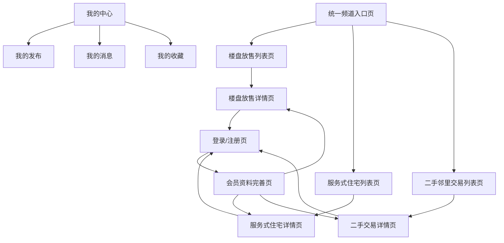
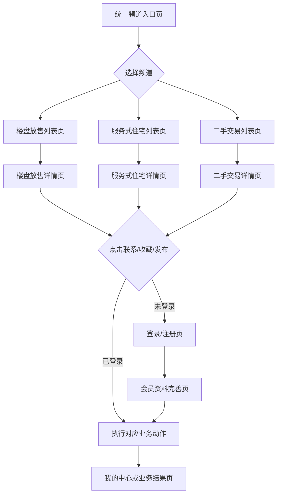
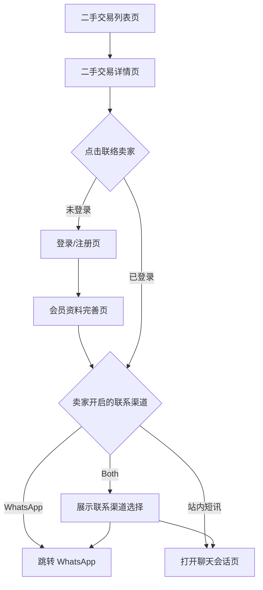
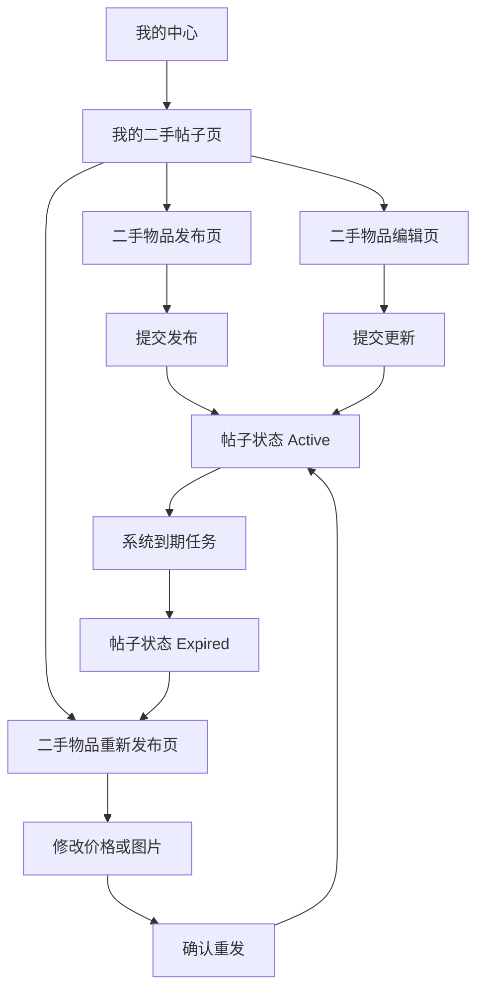
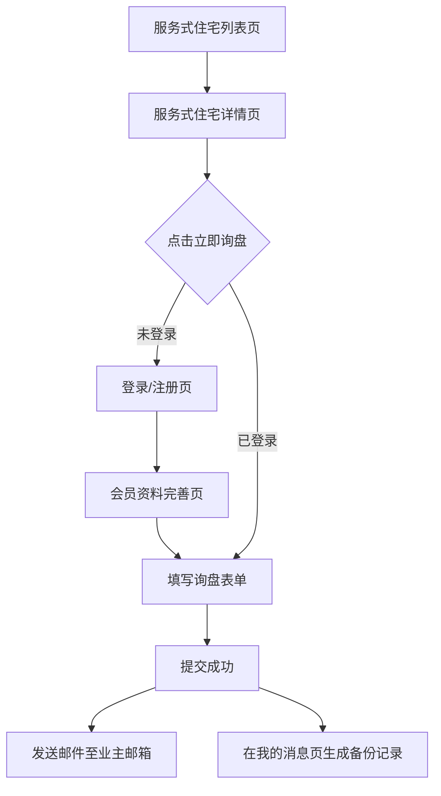

# 统一频道系统页面清单与页面流转图

## 1. 文档信息

| 项目 | 内容 |
| --- | --- |
| 文档名称 | 统一频道系统页面清单与页面流转图 |
| 适用范围 | 统一入口页 + 三大子模块 |
| 当前版本 | `v0.1` |
| 文档状态 | Draft |
| 上游输入文档 | `统一页面与三大子模块-功能总整理（简体）.md`、三份子模块需求文档 |
| 文档目的 | 统一页面范围、路由边界和关键转化链路，作为 IA、原型设计、前端路由设计和测试场景设计依据 |

## 2. 信息架构总览

## 3. 页面规划原则

### 3.1 规划原则
- 公共页面优先复用，不为单个子模块重复建设登录、消息、收藏、我的中心。
- 各子模块保持独立业务列表页、详情页、发布页和管理页。
- 路由和页面命名应支持未来扩展，不以临时页面命名。
- 页面清单需同时覆盖前台用户流和后台运营流，否则上线后缺乏可控性。

### 3.2 页面分层
- `L1` 公共层：登录、我的中心、我的消息、我的收藏等。
- `L2` 统一入口层：统一频道入口页与频道切换。
- `L3` 模块业务层：三个子模块的列表、详情、发布、管理。
- `L4` 运营后台层：内容审核、帖子管理、举报与用户处理。

## 4. 页面清单

### 4.1 公共页面

| 页面编码 | 页面名称 | 目标角色 | 页面层级 | 是否一期 | 页面说明 |
| --- | --- | --- | --- | --- | --- |
| `C-01` | 统一频道入口页 | 访客、会员 | 公共 | 是 | 承接三大子模块入口、精选内容、频道切换和发布引导 |
| `C-02` | 登录/注册页 | 访客 | 公共 | 是 | 统一手机号登录入口，负责登录墙承接和回跳 |
| `C-03` | 会员资料完善页 | 新会员 | 公共 | 是 | 补充大厦/屋苑信息、身份信息和基础偏好 |
| `C-04` | 我的中心首页 | 会员 | 公共 | 是 | 汇总我的发布、消息、收藏、积分或询盘入口 |
| `C-05` | 我的发布页 | 会员卖家、发布方 | 公共 | 是 | 以模块维度查看我的发布记录、状态和待处理事项 |
| `C-06` | 我的消息页 | 会员 | 公共 | 是 | 汇总站内消息、询盘备份和未读状态 |
| `C-07` | 我的收藏页 | 会员 | 公共 | 否 | 收藏房源、房型和二手物品 |
| `C-08` | 规则与帮助页 | 访客、会员 | 公共 | 否 | 展示发布规则、交易安全提示和常见问题 |

### 4.2 楼盘放售频道页面

| 页面编码 | 页面名称 | 目标角色 | 是否一期 | 页面说明 |
| --- | --- | --- | --- | --- |
| `PS-01` | 楼盘放售列表页 | 访客、会员 | 是 | 展示二手房源列表、搜索筛选和置顶信息 |
| `PS-02` | 楼盘放售详情页 | 访客、会员 | 是 | 展示房源详情、关键信息摘要和联系入口 |
| `PS-03` | 楼盘放售发布页 | 会员卖家 | 是 | 填写房源信息并发起积分发布 |
| `PS-04` | 楼盘放售编辑页 | 会员卖家 | 是 | 编辑已发布房源信息 |
| `PS-05` | 楼盘放售续期页 | 会员卖家 | 是 | 对过期房源执行积分续期 |
| `PS-06` | 购买积分页 | 会员卖家 | 是 | 充值 AJO Point 并完成支付 |
| `PS-07` | 积分流水页 | 会员卖家 | 是 | 查看充值、扣减和订单状态 |

### 4.3 服务式住宅频道页面

| 页面编码 | 页面名称 | 目标角色 | 是否一期 | 页面说明 |
| --- | --- | --- | --- | --- |
| `SA-01` | 服务式住宅列表页 | 访客、会员 | 是 | 展示项目列表、最低月租、设施标签和筛选 |
| `SA-02` | 服务式住宅详情页 | 访客、会员 | 是 | 展示项目级信息、房型信息、设施服务和询盘入口 |
| `SA-03` | 项目发布页 | 发布方 | 是 | 创建主项目并配置基础信息 |
| `SA-04` | 房型编辑页 | 发布方 | 是 | 维护子房型、价格、面积和图片 |
| `SA-05` | 项目续期页 | 发布方 | 是 | 对过期项目执行续期 |
| `SA-06` | 询盘记录页 | 发布方 | 否 | 查看提交到邮箱和站内信的询盘记录 |

### 4.4 二手邻里交易频道页面

| 页面编码 | 页面名称 | 目标角色 | 是否一期 | 页面说明 |
| --- | --- | --- | --- | --- |
| `NT-01` | 二手交易列表页 | 访客、会员 | 是 | 展示二手物品流、邻里筛选、分类筛选和免费送赠入口 |
| `NT-02` | 二手交易详情页 | 访客、会员 | 是 | 展示商品信息、尺寸、交收方式、邻里标签和联系入口 |
| `NT-03` | 二手物品发布页 | 会员卖家 | 是 | 创建商品、上传图片、设置可见范围和联络方式 |
| `NT-04` | 二手物品编辑页 | 会员卖家 | 是 | 编辑商品信息、图片和价格 |
| `NT-05` | 二手物品重新发布页 | 会员卖家 | 是 | 对过期商品执行重发并重置有效期 |
| `NT-06` | 我的二手帖子页 | 会员卖家 | 是 | 按状态查看我的二手帖子，执行编辑、下架和重发 |
| `NT-07` | 二手聊天会话页 | 会员 | 是 | 展示商品关联会话、未读状态和消息内容 |

### 4.5 运营后台页面

| 页面编码 | 页面名称 | 目标角色 | 是否一期 | 页面说明 |
| --- | --- | --- | --- | --- |
| `OPS-01` | 内容审核台 | 运营 | 是 | 审核楼盘、服务式住宅和二手帖子内容 |
| `OPS-02` | 帖子管理台 | 运营 | 是 | 查看帖子状态、执行下架、恢复、人工置顶和搜索 |
| `OPS-03` | 用户与风险处理台 | 运营 | 否 | 处理举报、封禁、敏感内容和违规用户 |
| `OPS-04` | 消息与询盘巡检台 | 运营 | 否 | 排查消息投递失败、询盘发送失败等问题 |

## 5. 关键页面流转图

### 5.1 统一频道主流程

### 5.2 二手邻里交易买家联系流程

### 5.3 二手邻里交易卖家发布与重发流程

### 5.4 服务式住宅询盘流程

## 6. 页面复用与拆分建议

### 6.1 可复用页面或模块
- 登录/注册弹层或页面。
- 我的中心主框架和二级导航。
- 我的消息页与消息会话容器。
- 多图上传、封面图设置、发布表单基础控件。
- 联系方式权限校验和登录墙拦截逻辑。

### 6.2 必须按业务拆分的页面
- 三个模块的列表页。
- 三个模块的详情页。
- 二手物品发布页、楼盘发布页、服务式住宅项目与房型编辑页。
- 积分购买页和询盘表单页。

## 7. 当前结论

- 统一频道系统需要采用“公共页面层 + 统一入口层 + 模块业务层 + 运营后台层”的四层页面结构。
- 若按一期交付，页面优先级应先覆盖公共能力、三个模块的列表详情、发布管理和最小运营后台。
- 本文档可直接作为后续路由设计、Figma 页面树和测试场景图谱的基线。
